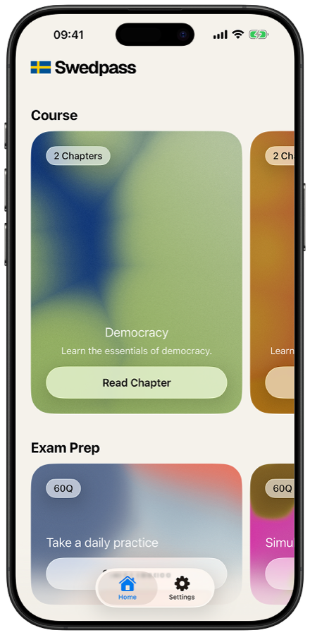
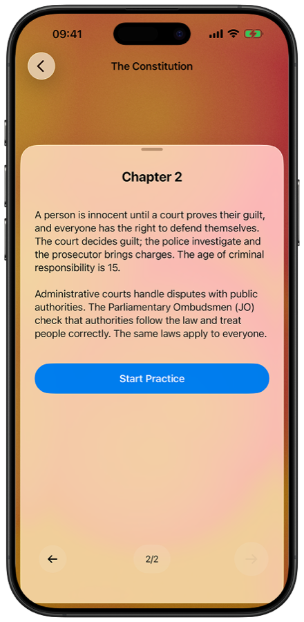
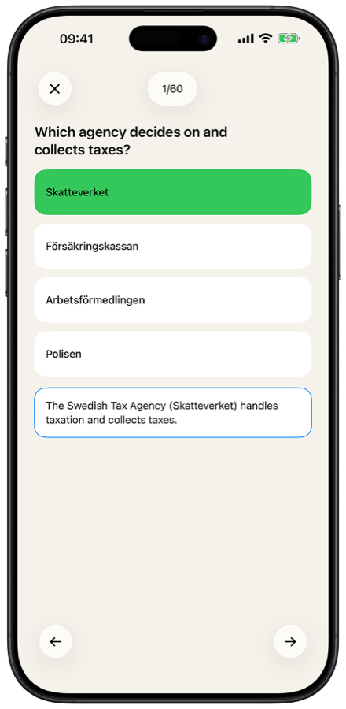
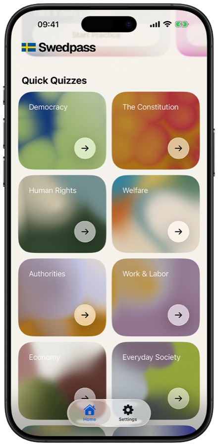
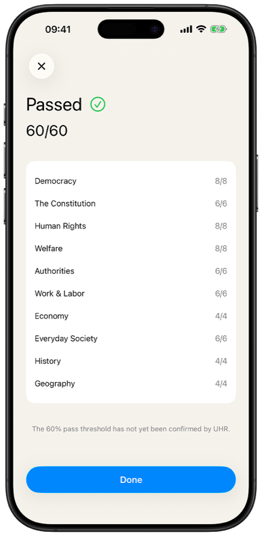
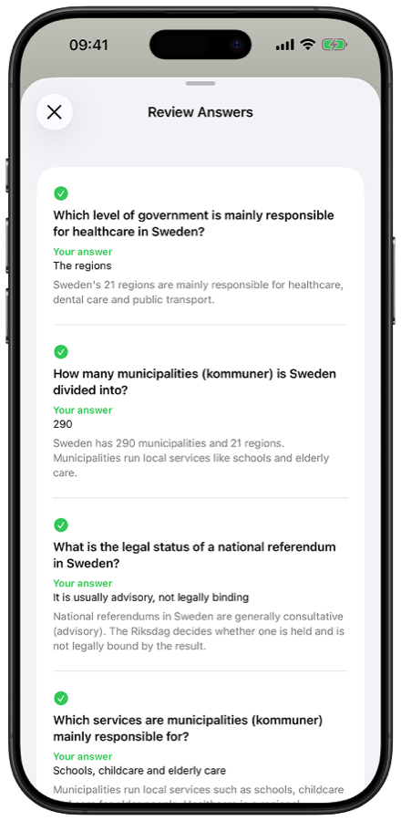

### Pass the Swedish citizenship test, in English.

A focused iOS study app for the Swedish *Knowledge of Society* citizenship exam
(*kunskapsprov i samhällskunskap*). Free, offline, no account.

[**swedpass.com**](https://swedpass.com) · [**Download on the App Store**](https://apps.apple.com/app/id6785233680)

 

---

> **About this repository.** This is a portfolio case study, not the source code.
> It documents the product thinking, design decisions, and architecture behind Swedpass.
> Designed and built by Brandon — Lead Product Designer.

---

## The problem

The official Swedish citizenship knowledge test is **60 questions in 90 minutes, in Swedish only**, and the authority (UHR) publishes no practice material. Applicants — many of whom are still learning Swedish — walk in blind, with nothing to rehearse against and no way to gauge readiness.

**Swedpass gives them the whole thing in a language they can study in:** the full exam experience, practice with explanations, and the entire syllabus, all in English.

---

## Screenshots

---

## What it does

| | |
|---|---|
| **Exam simulation** | A full 60-question, 90-minute run under real exam conditions: timed, no hints, scored by topic. Answers stay editable until submit, mirroring the paper test. |
| **Practice mode** | One question at a time with instant right/wrong feedback and a plain-English explanation. Answers lock on submit so feedback stays meaningful. |
| **Ten topics** | Every content area of the official UHR syllabus, each with a short primer to read before quizzing. |
| **Question Navigator** | Tap the tally to jump to any question in a fixed-slot grid — skip and return freely, no forced linear order. |
| **Offline & private** | Local question bank, no network, no account, no tracking. |

---

## Design decisions

The interesting part of this project was **deciding what *not* to build**. A citizenship exam is a finite, high-stakes, one-time event — that framing drove every call.

- **No gamification.** No streaks, no XP, no learning paths. The user is an adult preparing for a real test, not a player to retain. The UI is calm, text-forward, and distraction-free.
- **No progress tracking.** Topics aren't chained and studying is non-linear — someone dips into "law" today and "history" next week. A progress dashboard would be a dishonest empty shell, so there isn't one. (This is also why there's no Profile tab, only Settings.)
- **English everywhere.** The entire app — UI, questions, answers, explanations — is English. The whole value proposition is *removing* the Swedish-language barrier, so a language toggle would undercut it.
- **One screen, many modes.** Practice and Exam share a single question view driven by a `ModeConfig` struct (timer on/off, feedback on/off, re-answer on/off) rather than branching on mode everywhere. One surface to design, test, and maintain.
- **Ships free.** Originally freemium with a one-time unlock; pivoted to free-worldwide when the EU Digital Services Act would have required publishing a personal legal name to sell. The monetization architecture stays intact behind a single flag — a product/legal decision, cleanly reversible in code.
- **Content is a trust gate, not a feature.** Every question is tied to a source in the official syllabus. A wrong "correct" answer is a product failure a disclaimer can't cover, so unsourced questions are cut, not shipped.

---

## Design system

A small two-tier token system (primitives → semantic roles) so layout decisions live in one place. Screens consume only semantic tokens (`screenMargin`, `rowGap`, `cardFill`), never raw numbers — change a role once, every screen updates. Built on native semantic colors so dark mode and contrast come for free.

- **Palette:** warm off-white paper tone, Swedish blue (`#006AA7`) accent, system grays.
- **Type:** SF Pro (system) — no custom fonts.
- **Accessibility:** Dynamic Type across every screen (largest sizes tested on-device); dark mode by default.

---

## Architecture

| Layer | Choice |
|---|---|
| **UI** | SwiftUI (iOS 17+) |
| **State** | `@Observable` (Observation framework) |
| **Question bank** | Local JSON, decoded on launch — no backend, instant load |
| **Session engine** | Pure Swift: tiered sampling (8/6/4 by civic priority), shuffle-once, fixed-slot navigation, submit/scoring |
| **Purchases** | StoreKit 2 (non-consumable), entitlement-derived — dormant while free |
| **Distribution** | iPhone-only, portrait, fully offline |

The session engine is fully unit-tested (tier counts, scoring, mode rules) independent of the UI — the app's logic is verifiable without a single screen.

---

## Status

**Submitted to the App Store** as a free, worldwide, offline release. Companion marketing site at [swedpass.com](https://swedpass.com) (also built here).

---

Swedpass is an unofficial study aid. It is not affiliated with, endorsed by, or connected to UHR or any Swedish government authority. Always verify against official UHR material.

